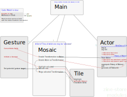

# Zine-Store

**Scope: Implementing a provisory firestore backend to prototype the [zine, an app for creating and infinite collages of editable hypertext blocks](https://github.com/upsiflu/zine).** In the long run, _the firestore will be replaced by a p2p backend_. Check [nextgraph](http://nextgraph.org/) and [P2PKB](https://drive.allmende.io/code/#/3/code/view/0082f96ab016f40545f0ed9dd31169e6/) for an emerging solution from TG, Nico and Jon.

<section style="background:rgba(0,180,160,.3); padding: 1.5rem 1em; margin: 2rem -1em;">

**What this sandbox is made for:**

Try out **CRDT**s and multi-avatar, multi-user cases
: `zine` is part of a larger p2p infrastructure project

Maintain a modular, **composable codebase** for later uses
: Elm modules and [custom-elements](https://guide.elm-lang.org/interop/custom_elements.html) are to be as orthogonal as possible and expose nice and coherent APIs

Evaluate and test **delightful Ui patterns** in Elm
: [Flupsi's Ui Glossary](https://flupsi.uber.space/UiGlossary.pdf#page=13) goes into the best practices, tenets, patterns and their implications, and is intended to base the Gui ontology and [API design](#gui)

**Ground conversations** around virtual collage-making
: this experiment is indebted to cyberfeminist theory and practices of [co-thinking and figuration](https://library.oapen.org/bitstream/handle/20.500.12657/49652/9783839457658.pdf?sequence=1&isAllowed=y#page=230)
</section>

_Check [the most recently deployed demo here](https://zine-store.web.app/)! If it's out of date, [deploy yourself](#deploying-the-frontend). For a sneak peek into the intended look-and-feel, check out [these Ui mockups](https://flupsi.uber.space/UiGlossary.pdf#page=13)._

------

## Features

- [x] [Authenticate and persist](#database-and-auth) 
- [x] [Moving and Scaling Tiles](#moving-and-scaling-tiles) with 2-finger gestures
- [ ] Editable Hypertext Tile
- [ ] Lasso Tile
- [ ] Scrolling and Zooming
- [ ] Adherence to [a design system](#gui)

### Database and Auth

- [x] Administer the `zine-store` project through the [Firebase console](https://console.firebase.google.com/?pli=1):
  - Change Auth providers
  - Change Rules

**Features:**

- [x] Optionally connect to the database through a `User`
: by means of a custom element `remote-user` with:
: **Events:**
  - onAuthChanged `{ token, email, uid }`
  - onNoteAdded `List String`
: **Attributes:**
  - logIn
  - addNote `String`
  - logOut

### Moving and Scaling Tiles

**Features:**

- [x] Implement a basic tile (square)
- [ ] Pointer layer to sense device-specific gestures
  - [x] Pinch on a touchpad
- [ ] Persist tile movement in the CRDT
- [ ] Wrap gestures in a custom element to limit the hitTarget 

### Gui

Check my [Glossary](https://flupsi.uber.space/UiGlossary.pdf) for a discussion of Gui elements. It aspires to exhaust the relevant bits of contemporary user interface culture, and to isolate patterns so they can base a functional, typed Gui library that would be one tier more abstract than a layout library such as elm-ui.

------

## Run a frontend test server

- Clone this repo, then install the external deps: `npm install`.
- Check the `.env` file in your root folder, which encodes the [Firebase config object](https://firebase.google.com/docs/web/setup#config-object).
- Run the local test server: `npm start`.

The local server will act upon the same database as the public one, but will use the locally supplied frontend files in `src/`. You can read the docs on port 8000 by [installing `elm-doc-preview`](https://github.com/dmy/elm-doc-preview) and running `edp`.

Deploy the frontend
: - to the Google hosting service: `firebase deploy`.
- to any other hosting server: run `npm run build`, then upload the `dist/` folder.

------ 

## Modules and their features

Gesture and Actor are singleton modules that communicate with [the infinitely vast Web Platform](https://developer.mozilla.org/en-US/docs/Web/API) either through ports (JSON exchange hubs between the world of Elm and the global JS context) or, preferably, through [custom elements](https://dev.to/leojpod/writing-custom-elements-for-elm-3agj), which are DOM nodes with their own tiny encapsulated[^1] JS app. 

- Gesture
: captures and abstracts platform-specific Pointer events.
  - [x] 2-finger pinch and scroll
  - [ ] Drag and Drop
  - [ ] Cancel (such as ESC or Tab-blur)
- Actor
: abstracts the User and their history of actions.
  - [x] Authentification via 
    - [x] Google
    - [ ] GitHub
    - [ ] E-Mail+Password
  - [ ] A history of Actions[^2]:
    - [ ] Actions can be sorted by its context[^3]
    - [ ] Before a new state is calculated, the history can be simplified
    - Do we want to generate relative or absolute state, i.e. does a history result in a mosaic, or does a history, given an existing mosaic, generate the difference to an intended mosaic?
- Mosaic
: _keeps a subset of all tiles, each positioned and otherwise transformed, and also manages scrolling and zooming the viewport, and forwarding transformations:_
  - [ ] scroll and zoom the viewport
        : 
  - [ ] activate
        : which tile(s) a future transformation will affect
  - _'activation' can be a function of the avatar's activity, and then avatars would be able to pick up and drop tiles wherever they go. This would make the whole app less miro/office-y and more game-like, immersive, laborious, and would give virtual distances more visceral effect!_
  - Transformations would eventually affect the active tile only once the avatar has walked there and done it. So `activate` would rather mean, `schedule` or `flag`.
  - the whole 'only an avatar, not the cursor, can cause anything in the virtual world' incidentially coincides nicely with an architecture where users 'own' actions.
  - [ ] co-affect
        : proliferates a transformation to tiles that are 'on top' of the active one. Think of it as what happens to a pile of paperscaps that you put on a large piece of paper. Moving this large piece of paper will affect the position of these paperscraps, too.
  - [ ] transform
        : associates with a tile or a set of tiles a delta on its:
        - [ ] scale (around the geometric center)
        - [ ] position (of its geometric center)
        - [ ] rotation (around 3 axes!)
        - [ ] [overlay mode](https://developer.mozilla.org/en-US/docs/Web/CSS/mix-blend-mode)
          1. occlude ("normal")
          2. illuminate ("screen")
          3. tint ("multiply")
        * white balance and gamma?
        - clipping and alpha mattes?
        - polynomial or grid transformation ("goo")?
  - [ ] cut, copy, paste
     : 
  - [ ] group and ungroup? 
- Tile
: atomic object that can be part of a `Mosaic`. A `Tile` has a uid and is either:
  - [ ] Hypertext
        : a sanitized HTML fragment
        - edit in place (quite WYSIWYG)
        - can contain images
  - [ ] Lasso Selection
        : indirectly (through 50% containment) determines the group of tiles that a future transformation on itself will _co-affect_
  - [ ] Avatar
        : an animal that follows the viewport of the associated actor. If multiple actors are associated to one avatar, it will become a 'team avatar', split into several animals.
        - can summon new tiles, cause transformations, pick up and drop tiles, and cut/copy/paste them. In order to do so, they need to be moved right over the tile to affect.

[^1]: While both approaches do have the same power, custom elements capture events (messages coming from JS) at a specific DOM node instead of the global level, which helps keeping the `update` functions quite local and encapsulated.
[^2]: Each user has a uid, and their actions have an `ordinal`, so any `uid`×`ordinal` adresses a unique action. In the provisory store implementation, firebase auto-generates the `uid`s as 'documents'.
_Note to self:_ This should align better with automerge.
[^3]: When an action is not the first ever action, the user triggering it has observed some action right before it. So it can be assumed that the new action is intended to follow this `contextual` action.

-------

## Authors

* [flupsi](https://flupsi.com) / [upsiflu on Github](https://github.com/upsiflu)

* This is a fork from [Julien Lengrand-Lambert](https://twitter.com/jlengrand)'s beautiful firestore+[Elm 0.19](https://elm-lang.org)+parcel [template](https://github.com/jlengrand/elm-firebase), as [announced here](https://lengrand.fr/using-firebase-in-elm/).

* `zine` is a collaboration with [Jon](https://github.com/almereyda) since fall 2021. Currently we are working in the frame of [nextgraph](team.nextgraph.org).

-------

<section style="text-align:center; background:rgba(128,128,128,.3); padding: 7rem 0; margin: -2rem 0;">💖 Have a lot of fun 💖</section>